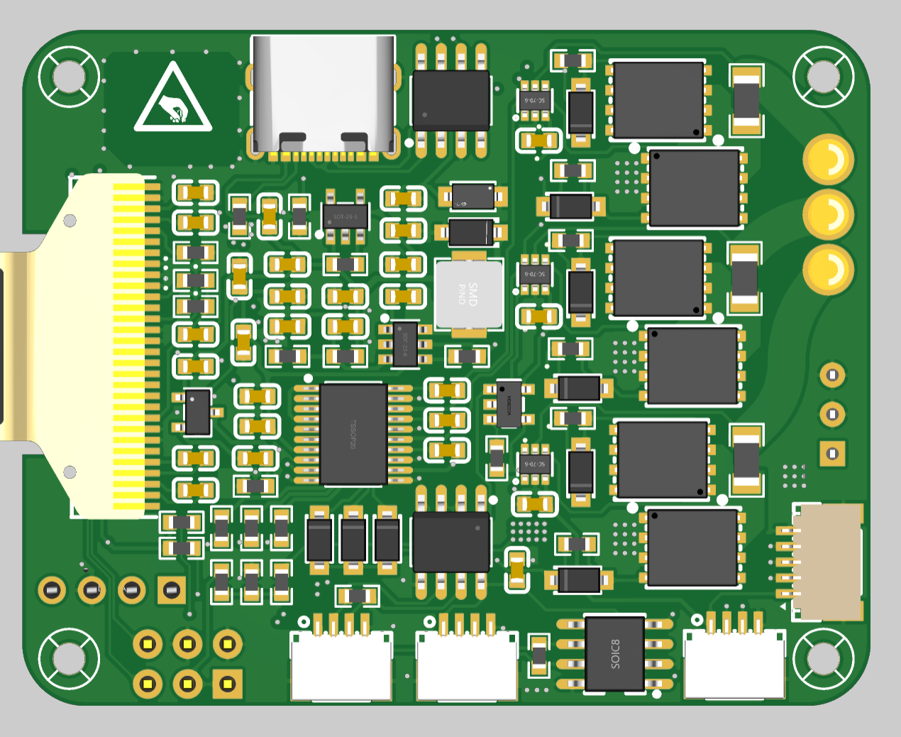
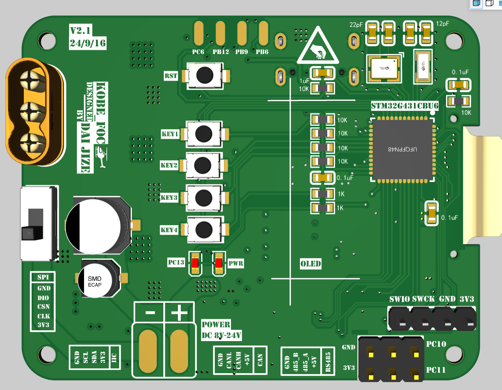
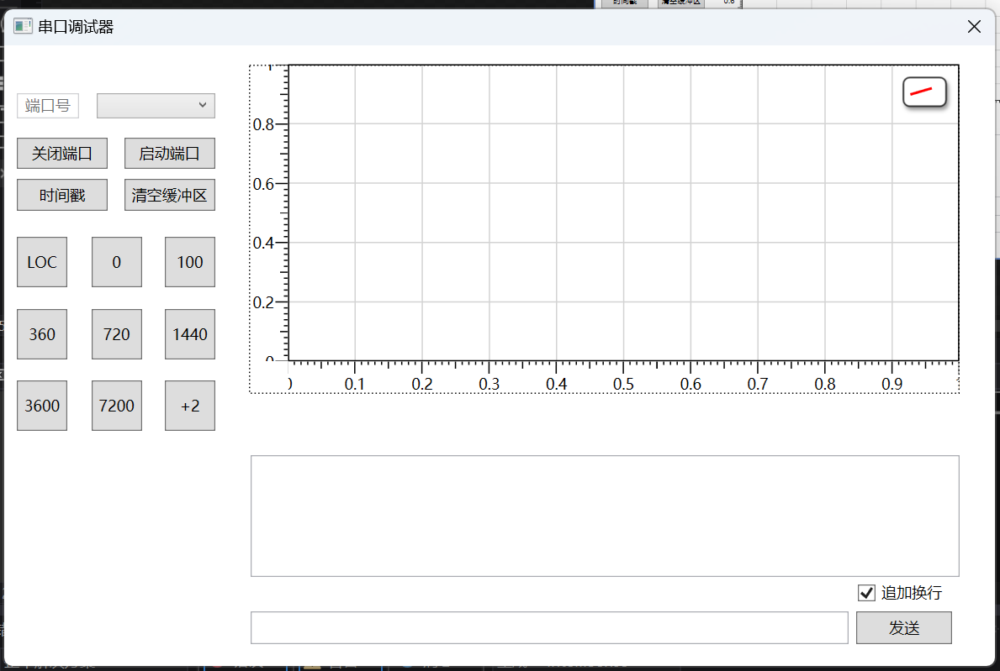

# KOBE_FOC

## 这是一个功能相对完善的FOC开发板

硬件部分使用立创eda制作，四层板

使用立创EDA专业版导入即可

板子的主控为stm32g431cbu6。

板子上接出了一路IIC，一路SPI，一路RS485，一路CAN，一路直出串口，一路串口转usb。

额外还有四个按钮，一个128*64的OLED屏幕，和一个可编程LED指示灯，芯片上四个没有用到的引脚被接出到四个焊盘上，可以焊接排针使用。
这些资源对于一个FOC开发板来说应该算是相当丰富了.

总电源支持8-24V输入。     
实测短时间内过流能力可以达到**5-10A**，可以考虑使用**增加铜箔厚度/开窗堆锡**等工艺来增加过流能力

栅极驱动器是EG2133，自带死区控制且相对廉价。选用的MOS管性能有点过剩，可以考虑更换其它型号MOS来降低成本。

采样电阻是三电阻InLine的，采样不需要考虑采样窗口，使用50倍的差分放大器进行放大之后连接到单片机的ADC1。   
实际上软件只使用了两个采样电阻，第三组可以去掉。

***************************************************************

软件部分使用CUBEMX开发，编辑器是Vscode的Embedded IDE插件。

__由于EIDE对工程的改动不会体现在Keil5工程文件中。__

__所以软件部分直接导入到keil5可能需要在工程中添加库文件。__

OLED驱动移植了u8g2库不过没写UI，写了串口控制器，可以解析简单的指令。

软件部分实现了有感foc的电流环，速度环和位置环。   
*（电流变换部分代码是高中自习课摸鱼写的，变量命名很随意。）*

调了一会参数，发现电流闭环效果一般，同时使用电流开环+速度位置闭环的效果良好，所以暂时不使用电流-速度-位置三闭环方式。

位置环经测试稳定性较好，在700KV的航模电机上运行角度定位精度在±0.5°以内。

暂时打算应用在智能车上，效果应该可以碾压直流有刷电机。

还编写了一个调试用的的WPF上位机，不过上位机还在完善中，暂不开源。
